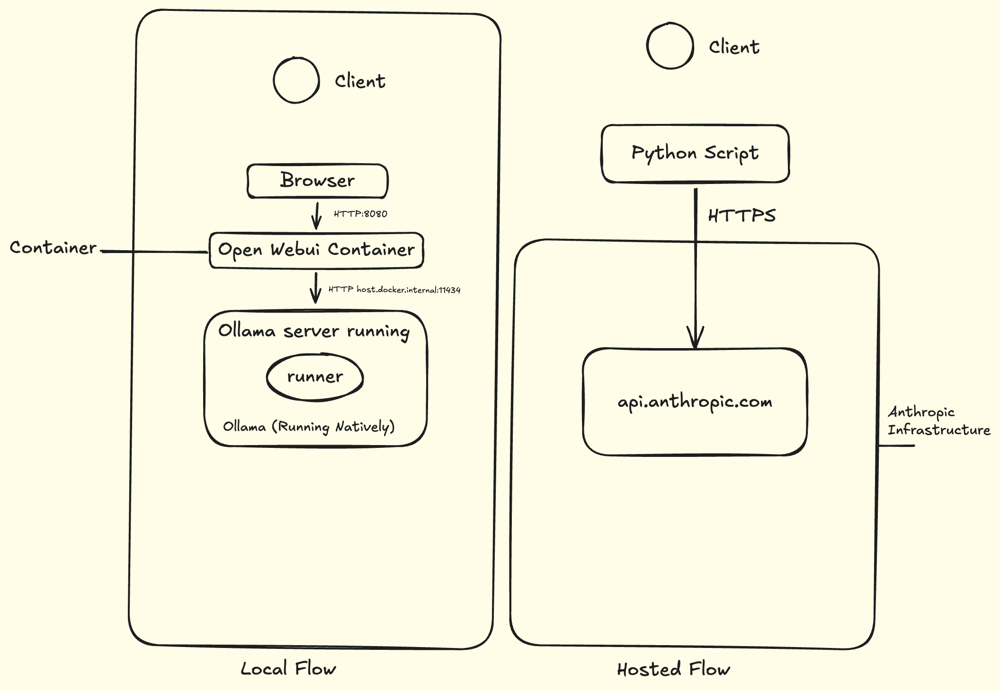

# GRC Evaluation Doc

# SECTION 1 : Executive Summary

## Overview
This document explains the security and performance trade-offs of whether to use a self-hosted LLM (Ollama + Mistral 7B) or a cloud-hosted LLM (Anthropic) for internal tasks.

## Audience
This document has been written to let the manager have a high-level overview about the performance of the developed system and decide whether to use this local setup for low-concurrency and sensitive internal use.

## Metrics Measured
The three main things measured are:

- Speed
- Cost
- Data residency

## Recommendation
My recommendation is:

- **Use the local setup** for single-user and sensitive workloads, where a waiting time is acceptable (3–15 seconds).
- **Use the cloud-based setup** where response speed matters and long context will be fed to the model, but it comes with a cost of sending the data outside the premise.

# Section 2 — Architecture

The local setup runs on a MacBook Pro with an Apple M3 Max processor and 64 GB of unified memory. Ollama serves the Mistral 7B model (Q5_K_S quantization, approximately 4.7 GB on disk) directly on the host operating system, listening on port 11434. Running natively rather than in a container allows the inference engine to use Apple's Metal framework for direct GPU acceleration. A separate Docker container hosts the Open WebUI application, which provides a browser-based chat interface at port 8080 and forwards user messages to the Ollama server via HTTP requests to `host.docker.internal:11434`. During normal operation, the local stack makes no external network calls; every prompt and generated response remains entirely within the laptop's memory and storage.

The hosted comparison uses Anthropic's Messages API, accessed over HTTPS at `api.anthropic.com/v1/messages`. The evaluation tests two specific model variants: Claude Haiku 4.5 (`claude-haiku-4-5-20251001`) and Claude Sonnet 5 (`claude-sonnet-5`). A Python benchmarking script constructs JSON payloads containing the prompt and sends them directly to the API endpoint, measuring client-side round-trip latency. Each request includes the API key for authentication. The API key is stored in a local `.env` file that is excluded from version control. Requests transmit the prompt in plaintext, encrypted in transit by TLS. Anthropic's infrastructure processes the request and returns the generated response along with token usage metadata; no model weights are stored locally, and the prompt data is transmitted and processed during the request by Anthropic's servers. Unlike the local setup, every prompt sent to this stack physically leaves the premises and travels over the public internet to Anthropic's servers.

Both setups were executed and their performance measured using the same six prompts from `prompts.json`, covering three context sizes (3 short sentences, 2 medium, 1 long) . Each prompt was run five times to enable meaningful comparison of client waiting time, tokens per second.

# Section 3 — Where does data go?

When a user types a prompt into the Open WebUI interface at `localhost:8080`, the browser sends that text as a JSON payload via HTTP POST to the Open WebUI backend running inside the Docker container. The container receives the prompt, formats it as a chat message, and forwards it to the Ollama server at `http://host.docker.internal:11434/api/chat`. Ollama receives the request on port 11434 and processes the prompt using the Mistral 7B model weights, which are loaded from disk (`~/.ollama/models`) on the first request and subsequently remain resident in unified memory (the RAM shared by CPU and GPU on Apple Silicon) for the duration of the keep-alive period. The generated response travels back through the same path: from Ollama to the Open WebUI container, then to the browser for display. The chat history is stored in an SQLite database (`webui.db`) inside the container's data directory (`/app/backend/data`), which persists to the named volume `open-webui-data` on the host filesystem. No component of this flow makes any outbound network connection to the internet; every byte of the prompt and response stays within the physical boundaries of the laptop. The only data persisted to disk is the local chat history, which never leaves the machine.

When the Python benchmarking script initiates a hosted request, it constructs a JSON payload containing the prompt and sends it via HTTPS POST to `https://api.anthropic.com/v1/messages`. The request travels over the public internet to Anthropic's infrastructure, where it is terminated at their API gateway. Anthropic's servers process the prompt through the requested model (Haiku or Sonnet) and generate a response. Anthropic returns the response body along with usage metadata (`input_tokens`, `output_tokens`). Both travel back over HTTPS to the Python script running on the laptop. The script parses the response, measures the round-trip latency, and stores the results in a timestamped CSV file on the local disk. The CSV file contains the full prompt text, response text, token counts, and timing data for each run. The API key used for authentication is read from the `.env` file at runtime and is never stored elsewhere. According to Anthropic's published API data handling terms, prompts and responses are not used for model training by default. Anthropic offers a Zero Data Retention (ZDR) option for the API, under which customer data is not stored at rest after the response is returned, except where required by law or to combat misuse. However, Anthropic does scan prompts and responses to enforce safety policies. Unlike the local setup, every prompt sent to this stack physically leaves the laptop and is processed on Anthropic's servers. For any production deployment, a formal review of Anthropic's current data handling and retention terms—specifically confirming whether Zero Data Retention is enabled—should be a prerequisite to approval.

# Section 4 — Performance and cost comparison
I measured three things for each provider and prompt type: how many tokens the model wrote back (output tokens), how long the user waited (client waiting time), and how fast the model generated tokens (tok/s). I used 6 prompts total, 2 per category (short, medium, long), and ran each one 5 times. The table below shows the average results.

| Provider | Category | Output Tokens (mean) | Client Wait (mean, seconds) | tok/s (mean) | tok/s (std) |
| :--- | :--- | :--- | :--- | :--- | :--- |
| Ollama | short | 169.5 | 3.52 | 46.00 | 5.29 |
| Ollama | medium | 388.0 | 8.95 | 43.37 | 1.73 |
| Ollama | long | 503.2 | 14.13 | 35.28 | 3.62 |
| Haiku | short | 210.6 | 4.02 | 45.41 | 22.68 |
| Haiku | medium | 338.5 | 5.25 | 65.53 | 10.86 |
| Haiku | long | 339.6 | 5.49 | 62.92 | 9.28 |
| Sonnet | short | 428.9 | 7.17 | 53.51 | 18.68 |
| Sonnet | medium | 791.9 | 12.01 | 65.28 | 8.21 |
| Sonnet | long | 932.4 | 12.60 | 74.26 | 5.55 |
For the medium prompts that would be typical for something like a hospital tool, Haiku gives the best user experience with a 5.25 second wait. Ollama is 8.95 seconds, which is acceptable for some uses, but Sonnet is worst at 12.01 seconds even though it has the highest tok/s.
The reason Sonnet takes longer even though its tok/s is high is that it writes way more text. On medium prompts it writes 791 tokens versus Haiku's 338. That's 2.3 times more text. Since generating text happens one token at a time, writing more tokens takes longer no matter how fast each token comes out. So comparing tok/s without looking at output length isn't fair.

Ollama slows down a lot when prompts get longer. It goes from 46 tok/s on short to 35 tok/s on long, which is about a 20% drop. I think this is because the KV cache gets bigger and the memory bus on the Mac can't move data fast enough. The hosted models don't have this problem because Anthropic runs on high-end GPU infrastructure with much more memory bandwidth than a laptop. Haiku actually gets faster on medium and long prompts because the bigger workload uses the GPU better.
Cost is another big difference. Local is basically free besides electricity. For the hosted API, based on Anthropic's published pricing (Haiku: $1/$5 per million input/output tokens; Sonnet: $2/$10 introductory), the whole benchmark cost was under $0.50[reference:5][reference:6]. Haiku is roughly $0.002 per request and Sonnet about $0.008 per request. If this went to production with lots of users the cost would matter more.

# Section 5 — What could go wrong (RISKS)

For the local setup, the biggest risk is that the laptop is a single point of failure. If the machine goes to sleep or the lid closes, Ollama stops responding and the service is down until someone wakes it up. This isn't a problem for a one-person test but would be a problem for a team. The second risk is quality: I didn't measure whether Mistral 7B gives accurate answers. It could hallucinate or give bad advice and I wouldn't know from my data. A third risk is that Ollama is an open-source project; if it stops being actively maintained, the project doesn't die immediately but security updates stop. That's a long term risk I can't control. A fourth risk is that the laptop hard drive fails or gets stolen. The chat logs are on the drive in an SQLite file, so if someone gets access to the drive they can read the conversation history. The model weights are public so that's fine, but the prompts and responses could be sensitive. I should probably encrypt the drive or at least think about where those logs live. Another risk is if someone else on the same network can talk to the Ollama server. Right now it only listens on localhost so that's fine, but if I changed that setting by accident it could be exposed. That's a configuration-hardening question, not a can't-happen question.

For the hosted setup, the main risk is that the API key leaks. It's in a `.env` file and excluded from git so that's good, but if someone gets the key they can make requests on my behalf and run up a bill. The second risk is that data leaves the building. Every prompt goes to Anthropic's servers. Even with HTTPS, the prompt text is readable on Anthropic's side. Their policy says they don't train on it, but that's a policy not a technical guarantee. A policy can change or be violated; a technical guarantee like data never leaving the machine can't. If Anthropic changed their policy or had a breach, that data could be exposed. A third risk is that Anthropic changes their pricing or deprecates a model. I used Haiku 4.5 and Sonnet 5 in my benchmark, but those version strings could stop working tomorrow and I'd have to update my code and re-run the comparison. A fourth risk is network connectivity. The hosted API requires internet access. If the office network goes down or there's a DNS problem, the service won't work. I don't know what the uptime guarantee is for Anthropic's API, so I can't say how likely this is but it's possible. The last risk is that the CSV file I saved locally contains all the prompts and responses in plain text. If someone gets access to my laptop they can read all the data I sent to Anthropic. That's basically the same risk as the local chat logs but with more data because I saved every run.

A final risk that applies to both setups is user error. Someone might paste something into the chat that they shouldn't—medical records, personal data, credentials. In the local case, that data stays on the machine but now lives in the SQLite chat log. In the hosted case, it's already left the building before anyone notices. Either way, it's a human behavior risk that no technical control fully eliminates.