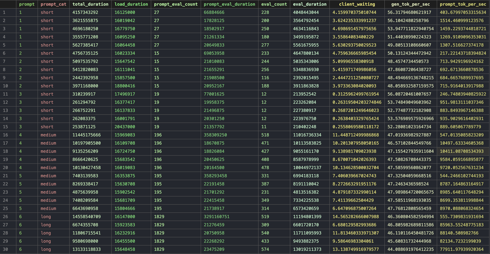

# A Practical Guide to Local LLM Deployment: Architecture, Quantization, and Hardware

This guide breaks down the core components of running a Large Language Model (LLM) locally, from the software stack that serves the model to the math that determines your hardware requirements.

## 1. The Architecture: Models, Servers, and Engines

Understanding the relationship between the software components is key to troubleshooting and optimization.

- **The Model**: This is the static file (containing the neural network's architecture, weights, and parameters). It is the "brain" but does nothing on its own.
- **The Inference Engine**: This is the workhorse. It runs the neural network, performs all the complex mathematical operations (matrix multiplications), and crucially, decides **where** the computation takes place (CPU or GPU).
- **The Model Server**: This handles the management of the model. It loads the model file from disk, manages it in memory, and serves it to handle incoming API requests.

**The Layer Stack:**
`Model Server -> Inference Engine -> The Model`

---

## 2. Ollama and `llama.cpp`

Ollama is a popular tool that simplifies local model management. Under the hood, it is essentially a wrapper that bundles three components into one user-friendly package:

1.  **The Model Server** (for API handling).
2.  **The Inference Engine**.
3.  **A CLI** for managing models.

The inference engine itself is not an original invention by Ollama. It is powered by a well-known open-source project called **`llama.cpp`**.

---

## 3. Model Formats and Quantization

### What is GGUF?

**GGUF** is the binary file format created by Georgi Gerganov (the creator of `llama.cpp`) for efficient storage and fast inference. It replaced the older GGML format and is the standard for models used in Ollama.

### What is Quantization?

Quantization is the process of shrinking the model file size. It reduces the precision of the decimal points used to store the model's weights (parameters). For example, a weight stored in 16-bit (FP16) can be reduced to 4-bit, 5-bit, or 8-bit.

- **Benefits:** You save significant memory (RAM/VRAM) and speed up inference.
- **Trade-off:** You might lose a small amount of quality (accuracy) in the generated text.

**The Golden Rule:** The number of parameters (e.g., 8 Billion) **does not change** after quantization. An 8B model is still an 8B model—it just takes up less disk and memory space because each of its 8 billion weights now uses fewer bits.

### How to Choose a Quantization (Q4, Q5, Q8)

| Tag | Bit-Depth | Best For |
| :--- | :--- | :--- |
| **Q4 (4-bit)** | **The Sweet Spot** | Most local deployments. Maximizes speed and fits models into limited hardware with negligible loss in reasoning. |
| **Q5 (5-bit)** | **The Middle Ground** | When your hardware has a bit more VRAM headroom, and you notice Q4 struggling with nuanced logic or complex formatting. |
| **Q8 (8-bit)** | **Near-Uncompressed** | When strict accuracy is critical (e.g., complex coding, data extraction) and you have abundant memory to handle the larger file size. |

### The Math: Calculating Memory Usage

You can calculate the approximate memory footprint of a model using this formula:

**Memory (GB) = (Number of Parameters * Bits per Parameter) / 8**

| Model Size (Params) | FP16 (16-bit) | Q8 (8-bit) | Q4 (4-bit) |
| :--- | :--- | :--- | :--- |
| **7 Billion** | ~14 GB | ~7 GB | ~3.5 GB |
| **13 Billion** | ~26 GB | ~13 GB | ~6.5 GB |

---

## 4. CPU vs. GPU: Why GPUs Win

Large language model inference is a **massively parallel, memory-bound** task. This makes the architectural differences between processors stark:

- **CPU (Central Processing Unit):** Built like a handful of Ferraris. Designed to tackle complex sequential tasks one at a time (low core count, high per-core performance).
- **GPU (Graphics Processing Unit):** Built like a massive fleet of cargo trucks. Possesses thousands of cores that operate simultaneously.

**The Bottleneck:** Every time the model generates a token, billions of weights must be fetched from memory and fed into the processor. A CPU has only a few memory channels, so it spends most of its time waiting for data to arrive (stalling).

**The Solution:** A GPU solves this with its massive **Memory Bandwidth** (the speed at which data can be read from or stored into memory). This allows it to flood its thousands of cores with data simultaneously, processing matrix multiplications at speeds a CPU cannot match.

### Memory Bandwidth Benchmarks

This is the most critical metric for AI inference speed.

**Typical Laptop DDR5 RAM (Dual-Channel):**
- ~75 to 90 GB/s (depending on speed, e.g., 4800 MT/s to 5600 MT/s).

**Consumer NVIDIA GPUs (GDDR6/6X VRAM):**
- **RTX 4070:** 504 GB/s.
- **RTX 4090:** ~1,008 GB/s (1 TB/s).

**Enterprise AI GPUs (HBM VRAM):**
- **NVIDIA H100 (SXM variant):** 3,350 GB/s (3.35 TB/s).


# KV Cache: The Memory Tax of Long Chats

## What Is KV Cache?

When an LLM generates text, it uses an "attention" mechanism that looks at all previous tokens. The **KV Cache** is a temporary storage area that saves the Key and Value calculations from those previous tokens.

## Why Do We Need It?

*   **Without KV Cache:** The model recalculates everything from scratch for every new token. If you have 100 tokens, it does 100 calculations. If you have 1000 tokens, it does 1,000,000 calculations. This gets impossibly slow.
*   **With KV Cache:** The model only calculates Keys and Values for the **new token** and reuses everything from before. This makes generation fast.

## The Problem Nobody Talks About

The KV cache is **not** a feature you turn up to make the model smarter. It's a **memory tax** that grows the longer you chat.

| How Long You Chat | KV Cache Size |
| :--- | :--- |
| Short conversation (50 tokens) | Tiny (~30 MB) |
| Medium conversation (500 tokens) | Noticeable (~250 MB) |
| Long conversation (2000 tokens) | Large (~1 GB) |
| Very long conversation (8000 tokens) | Huge (~4+ GB) |

## The Simple Formula

`KV Cache (GB) = 2 * Layers * Tokens * Hidden_Size * Precision / 1,000,000,000`

**What each part means:**
*   **Layers** - how deep the model is (usually 32-80)
*   **Tokens** - how many words/pieces you've chatted so far
*   **Hidden_Size** - how wide the model is (usually 4096-8192)
*   **Precision** - How many bytes per number (2 for normal, 1 for compressed)

## Real-World Example

**You have:**
*   A 7B parameter model (Q4 quantized) = ~4 GB
*   An RTX 4060 with 8 GB VRAM
*   A chat that goes back and forth for 2000 tokens

**The math:**
`KV Cache = 2 x 32 x 2000 x 4096 x 2 / 1,000,000,000 = ~1.05 GB`

**Total needed:**
`4 GB (model) + 1.05 GB (KV cache) = ~5.05 GB`

**You're safe!** But if the chat reaches 5000 tokens:

`KV Cache = 2 x 32 x 5000 x 4096 x 2 / 1,000,000,000 = ~2.6 GB`
`Total = 4 + 2.6 = 6.6 GB — still okay`

At 8000 tokens:

`KV Cache = ~4.2 GB`
`Total = 4 + 4.2 = 8.2 GB — CRASH! (Out of Memory)`

## How to Protect Yourself

| Strategy | What It Does | How to Do It |
| :--- | :--- | :--- |
| **Trim the chat** | Reduces tokens | Delete old messages from the prompt |
| **Quantize KV cache** | Reduces precision from 2 to 1 byte | Use `--kv-cache-type q8_0` in `llama.cpp` |
| **Restart** | Resets to zero | Start a new conversation |
| **Use larger GPU** | More room | Get a card with 12+ GB VRAM |

## The Golden Rule

> **Short chats = fast and cheap. Long chats = slow and memory-hungry.**

The KV cache makes generation fast, but it grows with every word you type. Plan for it, or it'll crash your app when you least expect it.


# Ollama Architecture: Core Concepts

---

## 1. Clients and Endpoints

`ollama run` and `curl` are both clients talking to the same Ollama server. They both send HTTP requests to `localhost:11434` — one is just a friendly terminal interface, the other is a raw HTTP tool.

| Client | What It Does |
| :--- | :--- |
| `ollama run` | Interactive chat in your terminal (human-friendly) |
| `curl` | Raw HTTP requests (script-friendly, programmatic) |

**Two endpoints serve different purposes:**

| Endpoint | Purpose | Input |
| :--- | :--- | :--- |
| `/api/generate` | Text completion / raw generation | Single `prompt` string |
| `/api/chat` | Conversational AI | Array of `messages` with `role` (system/user/assistant) |

> **What's missing?** The fact that both clients talk to the **same** server. They're not separate systems — they're just different ways of speaking to the same backend.

---

## 2. Two-Process Architecture (Why, Not Just What)

The Ollama server doesn't run as a single monolithic process. It splits into **two processes**:

| Process | Port | Job |
| :--- | :--- | :--- |
| **Main Server** | 11434 (fixed) | Receives requests, manages models, routes to runner |
| **Runner Subprocess** | Random (e.g., 52023) | Loads the model, runs inference, does the math |

**The flow:** 
Client → Main Server (11434) → Runner (52023) → inference → Runner → Main Server → Client.

**Why two processes instead of one?**

| Reason | Explanation |
| :--- | :--- |
| **Crash isolation** | If the runner crashes (OOM, GPU error), the main server stays alive and can spawn a new runner. |
| **Multi-model support** | Different models can run in separate runners simultaneously. |
| **Clean shutdown** | The main server can gracefully terminate runners, freeing GPU memory. |
| **Security** | The runner can run with limited permissions (sandboxed). |

> **What's missing?** The "why" was soft before. Now it's explicit. The two-process design isn't arbitrary — it's about resilience and resource management.

---

## 3. Performance Metrics (What the Numbers Mean)

When you send a request, Ollama returns timing data in the JSON response. Here's what each field tells you:

| Field | What It Means |
| :--- | :--- |
| `total_duration` | Total time from request to response (everything combined) |
| `load_duration` | Time to load the model from disk into memory (one-time cost) |
| `prompt_eval_count` | Number of tokens in your input |
| `prompt_eval_duration` | Time to process your input tokens |
| `eval_count` | Number of tokens in the generated response |
| `eval_duration` | Time spent generating the response tokens |

**Generation speed calculation:**

```text
eval_count ÷ (eval_duration ÷ 1,000,000,000) = tokens/second
```

**Example from your run:**
```text
18 tokens ÷ (304,479,208 ns ÷ 1,000,000,000) ≈ 59 tokens/second
```

> **Key insight:** The `load_duration` (~610ms in your run) only happens on the **first request**. With `OLLAMA_KEEP_ALIVE=5m`, the model stays in memory for 5 minutes — subsequent requests skip the load cost.

> **What's missing?** The connection between these metrics and real-world performance. **59 tok/s** is comfortable conversational speed — faster than you can read. Your baseline for benchmarking will be measured more rigorously later (longer prompts, varying context, multiple runs).

---

## 4. Concurrency and Memory

When two apps hit `localhost:11434` at the same time (e.g., Open WebUI in the browser and a Python script):

| Resource | Shared or Separate? |
| :--- | :--- |
| **Model weights** | ✅ Shared (one copy in GPU VRAM) |
| **KV cache** | ❌ Separate (each conversation has its own) |

**Request flow:**

1. Both requests hit the main server (port 11434).
2. By default (`OLLAMA_NUM_PARALLEL=1`), they're processed **sequentially** (queued).
3. The runner processes one, then the other.
4. Each request uses the **same model weights** but maintains its **own KV cache**.

**Why separate KV caches?**
KV caches store attention matrices for a specific conversation. Each request has different history, different tokens, different context. They can't be shared because they're tied to the input sequence.

> **The fundamental pattern:** Shared weights, separate KV caches. This is how every modern LLM serving system works — vLLM, TGI, Triton, all of them.

> **What's missing?** The parallel setting. `OLLAMA_NUM_PARALLEL=1` (default) = sequential. Setting it higher allows concurrent processing, but each concurrent request still gets its own KV cache.


# Open WebUI + Ollama: Architecture Deep Dive

---

## (a) What is Open WebUI?

Open WebUI is a **local chat interface** that runs on your machine. It gives you a ChatGPT-like UI in your browser and talks to Ollama behind the scenes.

**Tech stack:** Python/FastAPI backend with a Svelte frontend.

**Key point:** It's designed for **local-only** use — prompts and responses never leave your machine. It's not a hosting platform for exposing models to the public internet.

---

## (b) What Does Open WebUI Need to Know?

Open WebUI only needs the **URL of the Ollama server** — `http://localhost:11434`.

From this base URL, it can hit Ollama's API endpoints:
- `/api/tags` — list available models
- `/api/chat` — send messages
- `/api/generate` — text completion

**What it doesn't need:** Where model files are stored on disk (`~/.ollama/models`). Open WebUI never touches model files directly — that's Ollama's business. This is the HTTP/JSON contract in action: clean separation between services.

---

## (c) The Full Architecture

When everything is running, there are **four processes** on your machine:

| Process | Port |
| :--- | :--- |
| Browser | Dynamic (ephemeral) |
| Open WebUI | 3000 (default) or 8080 |
| Ollama Main Server | 11434 (fixed) |
| Ollama Runner Subprocess | Random (e.g., 52023) |

### The Flow (Three HTTP Hops)


**Hop-by-hop:**

| Hop | Direction |
| :--- | :--- |
| 1 | Browser → Open WebUI (you type a message) |
| 2 | Open WebUI → Ollama (port 11434) |
| 3 | Ollama → Runner (random port) — inference happens |
| 4 | Runner → Ollama → Open WebUI → Browser (response travels back) |

---

## (d) Why Docker Compose?

Docker Compose solves the problem of **orchestrating multiple processes**.

| Problem | How Compose Solves It |
| :--- | :--- |
| **Startup order** | Services start in the right order using `depends_on` |
| **Configuration** | Everything defined in one `docker-compose.yml` file |
| **Networking** | Containers find each other by name (e.g., `ollama:11434`) |
| **Reproducibility** | Same config works on any machine with Docker |
| **Single command** | `docker-compose up` starts everything |


# What is Docker Compose?

Docker Compose is a tool for **defining and running multi-container applications**. It lets you start everything with a single command instead of manually managing multiple containers.

Think of it as a "**project blueprint**." Without it, you'd have to manually run several commands every time you start your stack (Open WebUI + Ollama), make sure they start in the right order, and configure their networking correctly — tedious and error-prone.

## How It Works

| Step | What You Do |
| :--- | :--- |
| 1. Write a blueprint | Create a `docker-compose.yml` file defining all services (Open WebUI, Ollama), their configuration, and network settings |
| 2. One command starts everything | Run `docker compose up -d` — Compose starts all containers in the right order automatically |

## What It Solves

| Problem | How Compose Solves It |
| :--- | :--- |
| **Multiple commands** | One command starts everything (`docker compose up`) |
| **Startup order** | Services start in sequence using `depends_on` (e.g., Ollama before Open WebUI) |
| **Networking** | Containers automatically find each other by service name (e.g., `ollama:11434`) |
| **Configuration** | All settings (ports, volumes, env vars) in one declarative file |
| **Reproducibility** | Same `docker-compose.yml` works on any machine with Docker — your Mac, another Mac, a Linux server — identical setup |

## Example

**Without Compose:**
```bash
docker run -d --name ollama ollama/ollama
docker run -d --name openwebui -p 3000:8080 --link ollama ghcr.io/open-webui/open-webui

**Key insight:** Compose isn't about making it work — it's about making it **repeatable and portable** across machines and environments.

---
## Complete Setup: Conda Environment + Open WebUI

### Prerequisites

Before starting, ensure you have:
- **Conda** installed (Miniconda or Anaconda) 
- **Ollama** already running locally with your model loaded

---

### Step 1: Create the Conda Environment

Open a terminal and create a dedicated Conda environment for Open WebUI. Open WebUI requires Python 3.11 .

```bash
conda create -n open-webui python=3.11
```

**What this does:** Creates a new Conda environment named `open-webui` with Python 3.11 installed.

---

### Step 2: Activate the Environment

```bash
conda activate open-webui
```

**What this does:** Switches your terminal session to use the newly created environment. Any `pip` installs or Python commands will now run in this isolated environment .

---

### Step 3: Install Open WebUI

With the environment activated, install the Open WebUI package using pip:

```bash
pip install open-webui
```

**Optional:** Use a faster mirror if you're in a region with slow PyPI access .

```bash
pip install open-webui -i https://pypi.tuna.tsinghua.edu.cn/simple/
```

**What this does:** Downloads and installs the Open WebUI Python package along with all its dependencies (FastAPI, Svelte frontend assets, etc.) into your Conda environment .

---

### Step 4: Launch Open WebUI

Start the Open WebUI server:

```bash
open-webui serve
```

**What this does:** Starts the Open WebUI HTTP server. By default, it listens on `http://localhost:8080` .

---

### Step 5: Access the Interface

1. Open your browser and navigate to: **`http://localhost:8080`** 

2. You'll be prompted to create a local administrator account. You can use any username, password, and email — these are stored locally and only used for the UI's built-in user management .

---

### Step 6: Connect to Ollama

## How Open WebUI Detected Ollama

When you ran `open-webui serve` and visited `localhost:8080`, the auto-detection happened through a specific mechanism:

*   **The `/ollama` route in Open WebUI:** Behind the scenes, Open WebUI's backend acts as a reverse proxy. When the frontend UI needs to talk to Ollama, it makes a request to the `/ollama` route in Open WebUI.
*   **Forwarding to Ollama's API:** Open WebUI's backend forwards these requests to Ollama's API using a configured base URL. By default, this is `http://localhost:11434`.

So when Open WebUI loaded in your browser, it automatically queried `http://localhost:11434/api/tags` through its backend proxy. This endpoint returns the list of all models currently available in your Ollama setup.

**Key insight:** Open WebUI doesn't "scan" your computer. It simply makes an HTTP request to Ollama's API asking "what models do you have?", and Ollama responds with your list (including both Mistral and Llama Mini).

---

## Why It Chose Mistral Instead of Llama Mini (Beacuse i have many models served by Ollama in my local machine `ollama list`)

Open WebUI has a default model selection behavior:

*   **First model in the list:** When multiple models are available and no default is set, Open WebUI often selects the first one returned by the `/api/tags` endpoint. The order typically follows when models were pulled or alphabetically.
*   **Your specific setup:** If Mistral appears first in Ollama's response, it becomes the automatic selection. This is a convenience feature so you don't have to manually select a model for every new chat.
*   **You can change the default:** Once in the UI, you can:
    *   Click the model dropdown and select Llama Mini for your current chat.
    *   Set your preferred model as the default for future sessions.
    *   Admins can also set a global default model for all users.

**The bottom line:** Open WebUI didn't "choose" Mistral over Llama Mini because it preferred it. It simply picked the first model that Ollama's API reported, and Mistral happened to be that model in your current setup. You have full control to switch to Llama Mini or set it as your default whenever you want.

---


Open WebUI automatically detects Ollama running on `localhost:11434`. If you need to manually configure it, set the `OLLAMA_BASE_URL` environment variable before starting:

```bash
export OLLAMA_BASE_URL=http://localhost:11434
open-webui serve
```

---

## Summary: One-Line Commands

```bash
conda create -n open-webui python=3.11
conda activate open-webui
pip install open-webui
open-webui serve
```

Then open your browser to **`http://localhost:8080`**.

---

## What Each Step Does (In Plain English)

| Step | What It Does |
| :--- | :--- |
| `conda create` | Creates a clean, isolated Python environment so Open WebUI's dependencies don't conflict with other projects  |
| `conda activate` | Switches into that environment |
| `pip install open-webui` | Downloads the Open WebUI package and all its dependencies into your environment  |
| `open-webui serve` | Starts the web server that serves the chat UI  |

---

## Key Insight

The Open WebUI server and the Ollama server are **two separate processes** that communicate over HTTP :
- **Ollama** runs on port `11434`
- **Open WebUI** runs on port `8080`

Open WebUI is just another HTTP client talking to Ollama's API — exactly like the `curl` commands you've been using.


# Deep Dive: Open WebUI + Ollama Log Analysis

---

## Part 1: What the Logs Tell Us

### The Chat Works ✓

You sent "how are you doing today?" and Mistral responded properly. Note the *behaviorally correct* instruct-style response — "I'm an AI language model, so I don't have feelings..." — which is exactly what the `-instruct` fine-tune was supposed to give you. This confirms your earlier model-tag fix was the right call.

### The `[GIN]` Logs Prove the Contract ✓

```
[GIN] 2026/06/22 18:50:50 | 200 | 3.768344875s | 127.0.0.1 | POST | "/api/chat"
[GIN] 2026/06/22 18:50:51 | 200 | 866.113917ms | 127.0.0.1 | POST | "/api/chat"
[GIN] 2026/06/22 18:50:52 | 200 | 780.765542ms | 127.0.0.1 | POST | "/api/chat"
[GIN] 2026/06/22 18:50:52 | 200 | 577.159958ms | 127.0.0.1 | POST | "/api/chat"
```

These are **Open WebUI making HTTP calls to your Ollama server**. Same contract, same protocol as your `curl`. **Open WebUI is just another HTTP client.**

### Why Four POSTs for One Question?

A single user message in Open WebUI triggers **multiple** HTTP requests to Ollama:

| Request | Purpose |
| :--- | :--- |
| 1 | Main chat response to your question |
| 2 | Generate a chat title (e.g., "AI Assistant Chat") |
| 3 | Generate follow-up suggestions (e.g., "What kind of task do you need my help with?") |
| 4 | Additional UI enhancements (like auto-labeling) |

Open WebUI is doing extra work in the background to make the experience polished.

---

## Part 2: The Runner Log — A Goldmine

### 1. GPU Offloading on Apple Silicon

```
load_tensors: offloaded 33/33 layers to GPU
load_tensors: Metal_Mapped model buffer size = 4679.55 MiB
ggml_metal_init: picking default device: Apple M3 Max
```

**What this means:** All 33 transformer layers of Mistral are running on your M3 Max's GPU via Apple's Metal framework. Apple's unified memory means the model lives in the same physical RAM the GPU reads from — no copying. That's why your 59 tokens/sec feels snappy.

### 2. Context Window Limitation

```
llama_context: n_ctx = 4096
llama_context: n_ctx_seq (4096) < n_ctx_train (32768) -- the full capacity of the model will not be utilized
```

**What this means:** Mistral 7B was *trained* with a 32,768 token context window. But Ollama loaded it with a runtime context of only **4,096**. You're using one-eighth of the model's capacity.

**Why?** Look back at the `ollama serve` config dump — `OLLAMA_CONTEXT_LENGTH:4096`. That's Ollama's default, deliberately conservative to save memory.

### 3. KV Cache — In the Wild

```
llama_kv_cache: Metal KV buffer size = 512.00 MiB
llama_kv_cache: size = 512.00 MiB (4096 cells, 32 layers, 1/1 seqs), K (f16): 256.00 MiB, V (f16): 256.00 MiB
```

**What this means:** 512 MiB of memory allocated up-front for the KV cache:
- Split as 256 MiB for Keys (K) and 256 MiB for Values (V)
- Sized for 4096 cells (the context window)
- Across 32 layers (Mistral's depth)

When you chat, on top of the ~4.7 GiB of model weights, you're paying another **512 MiB** just for the KV cache to hold conversation context up to 4096 tokens.

### 4. Model Loading Time

```
"llama runner started in 2.64 seconds"
```

**What this means:** When Mistral wasn't already loaded, spinning it up took 2.64 seconds.

Now look at the *first* `[GIN]` POST: **3.768 seconds total**. That first response was slow because:
- 2.64s = loading the model into memory
- 1.12s = actual inference

Subsequent responses: 866ms, 780ms, 577ms. **That's the difference between cold start and warm.**

> **Key insight for benchmarking:** You cannot fairly measure inference speed using the first request — the model has to be warmed up first.

---

## Part 3: Pop Questions Answered

### (a) Why Does Open WebUI Ask for an Account on Localhost?

Open WebUI asks for an account on localhost because it's designed to support **multi-user** functionality even when running locally. It has:

- Built-in user management (authentication)
- Conversation history tied to users
- Settings and preferences per user

It's not *required* — you can usually skip sign-up or use a default admin account — but it's there to support more than one user on the same instance. For your local use, it's overkill, but it's a design decision that keeps local and multi-user modes consistent.

Open WebUI is designed for multi-user scenarios — even on localhost, it has the auth machinery built in because the same app gets deployed in team settings. The first user becomes the admin. It's a reasonable default given Open WebUI's broader use case, even if it feels overkill for a one-person laptop setup.

### (b) How Did Open WebUI Find Ollama?

Open WebUI automatically discovers Ollama in two ways:

1. **Default to `http://localhost:11434`** — If no configuration is set, it assumes Ollama is running on the default port.
2. **Environment variable override** — You can set `OLLAMA_BASE_URL` to point elsewhere.

In your case, since both were running on the same laptop, Open WebUI likely defaulted to `http://localhost:11434` without any explicit configuration. If you had needed to configure it manually, you'd set `OLLAMA_BASE_URL=http://localhost:11434` in Open WebUI's environment.

 Open WebUI ships with a default config that points at http://localhost:11434 or http://host.docker.internal:11434 (the latter matters when in Docker — file that for milestone 3). Since you ran Open WebUI natively on the same machine where Ollama is running natively, the default localhost URL worked without any config.
This is fine for a laptop. In production, hardcoded localhost defaults are a footgun — services discover each other through config (env vars, service registries, DNS, etc.), never assumptions. 

---

## Part 4: KV Cache at 32k Context

**Question:** If you increased `OLLAMA_CONTEXT_LENGTH` to the full 32,768, what happens to the KV cache size?

### The Math

From the log:
- KV cache at 4096 tokens = 512 MiB
- Context grows linearly with token count

**At 4096 tokens:** 512 MiB
**At 32,768 tokens:** 512 MiB × (32768 / 4096) = 512 MiB × 8 = **4,096 MiB (4 GiB)**

### Breakdown at 32k Context

| Component | Size |
| :--- | :--- |
| Model weights (unchanged) | ~4.7 GiB |
| KV cache (32k tokens) | ~4.0 GiB |
| **Total** | **~8.7 GiB** |

**What this means:** Your M3 Max has 48 GiB of unified memory, so it can handle it. But many consumer GPUs (e.g., RTX 3060 with 12GB) would struggle or fail at 32k context. This is why Ollama's default is conservative — they want it to work on more hardware.

---

## Part 5: The 3-Hop Walkthrough

You type "how are you doing today?" in Open WebUI and press Enter.

### Hop 1: Browser → Open WebUI (Port 8080)

| Detail | Value |
| :--- | :--- |
| **What happens** | Your browser sends an HTTP request to Open WebUI's web server |
| **URL** | `http://localhost:8080` |
| **Payload** | HTML form data with your message |
| **Protocol** | HTTP (could be HTTPS in production) |
| **Evidence** | Not in the logs, but you accessed `localhost:8080` in your browser |

### Hop 2: Open WebUI → Ollama (Port 11434)

| Detail | Value |
| :--- | :--- |
| **What happens** | Open WebUI constructs a JSON payload and sends it to Ollama's `/api/chat` endpoint |
| **URL** | `http://localhost:11434/api/chat` |
| **Payload** | JSON with model name and messages array |
| **Protocol** | HTTP/JSON |
| **Evidence** | `[GIN] 2026/06/22 18:50:50 | 200 | ... | POST | "/api/chat"` |

### Hop 3: Ollama → Runner (Random Port)

| Detail | Value |
| :--- | :--- |
| **What happens** | Ollama forwards the request to the runner subprocess |
| **URL** | `http://localhost:52023` (or whatever random port) |
| **Payload** | The same prompt, but internal format |
| **Protocol** | HTTP (internal) |
| **Evidence** | Not in the logs, but you know the two-process architecture from earlier |

### The Return Journey

The runner generates the response, sends it back to Ollama, which sends it back to Open WebUI, which renders it in your browser. The `[GIN]` log line with status `200` confirms the request succeeded.

---

## Part 6: Why Two Web Servers? (Software Design Argument)

Ollama didn't build its own chat UI because **it's a model server, not a chat app.**

| Why Ollama Stays Separate | Why Open WebUI Exists |
| :--- | :--- |
| Focuses on model serving, not UI | Focuses on user experience, not model serving |
| Stable API contract for any client | Can iterate quickly on UI without changing Ollama |
| Reusable by multiple projects (Open WebUI, Continue.dev, private apps) | Can be swapped for another client (e.g., LibreChat) |
| Single responsibility | Single responsibility |

**It's a separation of concerns:** Ollama handles "how to run models." Open WebUI handles "how to chat with them." They can evolve independently.

a clean HTTP contract between them lets each one evolve independently. Open WebUI can support Ollama, OpenAI's API, Anthropic's API, vLLM, LM Studio, and others — because none of those backends know or care that Open WebUI exists; they just speak HTTP. Conversely, Ollama works with Open WebUI, Continue, the Cursor editor, custom Python scripts, anyone — because Ollama doesn't know who its client is.

---

## Part 7: Swapping Models (Transfer Question)

**Question:** Tomorrow you want to swap Mistral for Llama 3.1 8B. What do you have to do?

| Action | Required? | Why? |
| :--- | :--- | :--- |
| Pull Llama 3.1 | Yes | `ollama pull llama3.1:8b` |
| Change Open WebUI config | **No** | Open WebUI queries `/api/tags` to list models dynamically |
| Restart Open WebUI | **No** | It reads the model list from Ollama at runtime |
| Restart Ollama | **No** | Ollama can load/unload models on demand |
| Select new model in UI | Yes | Choose Llama 3.1 from the dropdown in Open WebUI |

**Key insight:** Open WebUI doesn't hardcode model names. It queries Ollama's `/api/tags` endpoint to see what's available. The UI dynamically updates.

Open WebUI hits /api/tags to list available models, and the new one shows up in its dropdown automatically. Switch model in the UI, start chatting. No restarts. No config changes.

---

## Part 8: Industry-Framing (Company Scale)

A real company wants to give 50 employees a private chat UI talking to a self-hosted LLM. Three things that have to change:

### 1. Authentication and Authorization

| Current Setup | Required for Company |
| :--- | :--- |
| No authentication (localhost only) | Enterprise SSO, role-based access, user management |
| Anyone with local access can use it | Only authorized employees can access |

### 2. Load Balancing and Queuing

| Current Setup | Required for Company |
| :--- | :--- |
| Single Ollama instance, `OLLAMA_NUM_PARALLEL=1` | Multiple workers, request queuing, load balancing across GPUs |
| Sequential processing of requests | Parallel handling with fair queuing |

### 3. Security and Residency

| Current Setup | Required for Company |
| :--- | :--- |
| Localhost only, no network exposure | HTTPS, TLS, firewall, private VPC |
| No logging or audit trail | Audit logs, prompt/response logging, compliance |
| Single user | Multi-tenant with data isolation |


- Dedicated compute — a server (or fleet of servers) with one or more GPUs powerful enough to handle 50 concurrent users. An RTX 4090 might handle a handful of simultaneous chats with Mistral 7B at decent speed; an H100 will handle many more. This is a capacity-planning problem you don't have on a laptop.
- A different inference stack — Ollama isn't built for this. As I mentioned a while back, real production self-hosted inference uses vLLM, TGI, or Triton, which do continuous batching (multiple requests share GPU work efficiently) and paged attention (smarter KV cache management). Ollama processes requests one at a time (or N at a time if you set OLLAMA_NUM_PARALLEL, but it's not its strength).
- Networking and security — the 50 users are on their laptops, not the GPU box. You need to expose Open WebUI somewhere they can reach it (likely via a reverse proxy with TLS), separately from where Ollama runs (Ollama should not be exposed to users directly; only Open WebUI should). That's an architectural change.

---


# Local AI Infrastructure & Docker Architecture

This document defines the architectural blueprint, underlying mechanisms, and operational requirements for deploying a local Large Language Model (LLM) stack (Ollama + Open WebUI) natively on Apple Silicon hardware.

## Part 1: Core Docker Mechanics

### Containers vs. Virtual Machines (Virtualization Models)
Understanding the architectural difference between VMs and containers is critical for resource allocation and performance tuning.
* **Virtual Machines (Hardware-Level Virtualization):** A VM relies on a hypervisor to emulate physical hardware. It requires a complete, independent Guest Operating System kernel to be installed on top of the virtualized hardware. This results in significant overhead, high memory utilization, and slower boot times, as the entire OS must initialize.
* **Docker Containers (OS-Level Virtualization):** Containers do not run a separate OS kernel. Instead, they utilize features of the host's operating system (such as `cgroups` and `namespaces` in Linux) to create isolated user spaces. Multiple containers share the exact same underlying host kernel. This eliminates the emulation overhead, resulting in processes that start in milliseconds and utilize minimal compute resources beyond what the application itself requires.

### Storage & Persistence Models
By default, Docker containers are ephemeral. The container's writable layer is tied strictly to its lifecycle; if the container is removed, all internal data (e.g., a 5GB downloaded AI model) is permanently destroyed. Persistent storage must be explicitly declared.

#### Bind Mounts vs. Named Volumes
* **Bind Mounts:**
    * **Mechanism:** Maps a specific, absolute path from the host machine's filesystem directly into the container's filesystem. 
    * **Control:** Managed entirely by the host OS. Changes made on the host are immediately reflected in the container and vice versa.
    * **Use Case:** Optimal for active development where source code needs to be edited on the host IDE and executed in the container, or for injecting static configuration files.
* **Named Volumes:**
    * **Mechanism:** Docker provisions and manages a dedicated storage directory within its own internal file structure (typically `/var/lib/docker/volumes/` on Linux). 
    * **Control:** Managed by the Docker daemon. The exact host filesystem path is abstracted away from the user.
    * **Use Case:** Optimal for application-private data, databases (SQLite, PostgreSQL), and downloaded model weights. It bypasses host-level file permission conflicts and optimizes read/write performance.

**Decision for Open WebUI:** A **Named Volume** is utilized for the internal SQLite database (`webui.db`). Because this data is exclusively read and modified by the application, letting the Docker daemon manage the storage ensures data integrity across container rebuilds and avoids file-locking issues common when mapping databases directly to macOS host directories.

## Part 2: Network Architecture

### Host Networking vs. Docker Bridge Networks
* **Host Network:** The physical network interface of the machine (e.g., your laptop's Wi-Fi connection), addressable via standard IP routing protocols on your local subnet.
* **Docker Bridge Network:** A software-defined virtual network. When a Docker Compose stack is initialized, the Docker daemon creates a private `bridge` network. Containers attached to this bridge are assigned internal IP addresses within an isolated subnet. Docker provides an embedded DNS server that resolves container names (e.g., `open-webui`) to their respective internal IP addresses, allowing secure, inter-container communication that is inaccessible from the host network by default.

### Port Publishing (NAT Routing)
To allow the host machine to interact with services running inside the isolated Docker network, explicit port mapping is required.
* **Mechanism:** Defining a port mapping (e.g., `11434:11434`) instructs the Docker daemon to configure Network Address Translation (NAT) rules. This forwards traffic received on a specific port on the host machine's interface directly to the corresponding port on the container's internal IP address.

### The Network Namespace Isolation (The "Localhost" Trap)
Because containers utilize network namespaces for isolation, the loopback interface (`127.0.0.1` or `localhost`) inside a container routes only to that specific container. If an application inside Container A attempts to send traffic to `http://localhost:11434`, the request never leaves Container A's namespace. It will not resolve to Container B, nor will it resolve to the physical host machine.

## Part 3: The macOS Hardware Reality

### The Hypervisor Boundary and Hardware Acceleration
Docker natively requires a Linux kernel. Because macOS uses a different kernel architecture (Darwin), Docker Desktop for Mac operates by provisioning a lightweight Linux Virtual Machine via Apple's Hypervisor framework. 

Apple's Metal API—the proprietary framework required to leverage the GPU and Neural Engine on Apple Silicon (M-series chips)—does not support hardware pass-through into this Linux VM. Consequently, any process executed inside a Docker container on macOS is isolated from the GPU hardware and is forced to rely on standard CPU instruction sets. For LLM inference engines like Ollama, this results in severe performance degradation.

### The Hybrid Architecture Strategy
To maintain hardware acceleration while utilizing container orchestration, the deployment is split across the virtualization boundary:
1.  **Compute Layer:** Ollama is installed natively on the macOS host environment. This grants the binary direct, unfiltered access to the Metal API for high-speed GPU inference.
2.  **Application Layer:** Open WebUI is deployed within a Docker container to encapsulate its web serving dependencies and application state.
3.  **The Routing Bridge:** To allow the containerized Open WebUI application to communicate with the native Ollama binary, the environment variable `OLLAMA_BASE_URL` is configured to `http://host.docker.internal:11434`. The Docker embedded DNS resolves `host.docker.internal` to the internal IP address used by the host, successfully routing the traffic out of the Linux VM and onto the host's network interface.

## Part 4: The Infrastructure as Code Blueprint

The `compose.yaml` file defines the declarative state of the infrastructure, ensuring reproducible deployments and version-controlled configuration. 

```yaml
services:
  open-webui:
    image: ghcr.io/open-webui/open-webui:main
    container_name: open_webui
    # Port Publishing: Forwards traffic from Host port 3000 to Container port 8080
    ports:
      - "8080:8080"
    # DNS Resolution: Routes API calls out of the Docker VM to the macOS host
    environment:
      - OLLAMA_BASE_URL=http://host.docker.internal:11434
    # State Persistence: Attaches the Docker-managed volume to the application data directory
    volumes:
      - open-webui-data:/app/backend/data
    # Lifecycle Policy: Prevents automated daemon restarts for granular developer control
    restart: "no"

volumes:
  # Provisioning block for the Docker-managed storage volume
  open-webui-data:
```

## Part 5: Operational Readiness & Security Context

1.  **Network Binding & Security Posture:** By default, the native macOS Ollama application binds strictly to the host's loopback interface (`127.0.0.1`). To accept incoming API requests routed from the Docker VM interface, the application must be configured to listen on all interfaces by setting the environment variable `OLLAMA_HOST=0.0.0.0`. 
    * *Security Imperative:* Binding to `0.0.0.0` exposes the Ollama API port (`11434`) to the physical Local Area Network (LAN). If operating on untrusted networks, the macOS application firewall must be configured to deny external incoming connections to this port while permitting internal Docker subnet traffic.
2.  **State Initialization:** The Ollama inference engine initializes without any pre-loaded LLM weights. Before Open WebUI can successfully execute generation requests, the required model artifacts must be downloaded to the host machine via the command line interface (e.g., `ollama run mistral`).
3.  **Immutable Upgrades:** Container images are immutable. Software updates for Open WebUI are not executed within the running container. The upgrade protocol requires stopping and removing the current container (`docker compose down`), pulling the latest image tag from the registry (`docker compose pull`), and instantiating a new container (`docker compose up -d`). Because application state is decoupled via the Named Volume, the new container instance automatically mounts the existing `webui.db` file, resulting in zero data loss.


## Question 1
**You wrote `restart: "no"` in your Compose file with the quotes. Why the quotes? What specifically goes wrong if you write `restart: no` without them?**

**Answer:**
Without quotes, YAML parses `no` as the boolean `false`. This breaks the Docker Compose restart policy parser because it specifically expects a string keyword (e.g., `"no"`, `"always"`, `"on-failure"`, `"unless-stopped"`). Wrapping it in quotes ensures it is evaluated as a string.

---

## Question 2
**Inside the Compose file, you have `volumes: - open-webui-data:/app/backend/data` under your service, and `volumes: open-webui-data:` at the bottom. Same word "volumes" appears twice with different jobs. What is each block doing? Which one would you remove if you wanted to switch from a named volume to a bind mount, and what would the replacement look like?**

**Answer:**
*   **Bottom-level `volumes:` block:** Declares a named volume that the project owns. Docker manages the actual storage location of this volume internally.
*   **Service-level `volumes:` block:** Lists the specific mounts for that container (mapping the volume or host path to a directory inside the container).

**To switch to a bind mount:**
1.  Remove the bottom-level `volumes:` block entirely, because bind mounts don't need to be declared—the path on the host acts as the volume.
2.  Replace the service-level volume line with the syntax `host_path:container_path`. For example:
    `- ./webui-data:/app/backend/data`
    *(Note: The leading `./` makes it relative to the Compose file, which is highly recommended for portability.)*

---

## Question 3
**Right now your stack uses `host.docker.internal:11434` to let the container reach Ollama on your Mac. Suppose, hypothetically, you decided tomorrow to put Ollama inside the Compose file as a second service (forget the GPU issue for this question — imagine it works). What changes about how Open WebUI addresses Ollama? Be specific about the URL.**

**Answer:**
1.  **URL Change:** The URL changes from `http://host.docker.internal:11434` to `http://ollama:11434`. Docker Compose has internal DNS, so services can resolve each other using their service names as hostnames over the internal bridge network.
2.  **Cleanup `extra_hosts`:** You must remove the `extra_hosts: - "host.docker.internal:host-gateway"` block from Open WebUI. It is dead code once both services are on the internal network.
3.  **Add `depends_on`:** You should add a `depends_on:` block to the **Open WebUI** service (the service that has the dependency) listing `ollama`. This tells Compose not to start Open WebUI until the Ollama container has started.

---

## Question 4
**You ran `docker compose ps` and the status said `Up 2 minutes (unhealthy)` initially, then later flipped to `healthy`. What is Docker actually doing to decide which of those two statuses to show? Where does the definition of "healthy" come from — your Compose file, the Open WebUI image, Docker itself, or somewhere else?**

**Answer:**
*   **Where the definition comes from:** The healthcheck definition is baked directly into the **Open WebUI Docker image** by its maintainers using a `HEALTHCHECK` instruction in their Dockerfile. (You can override it in the Compose file, but if you don't, it defaults to the image's settings).
*   **What Docker is doing:** Docker periodically runs the command defined in that healthcheck (typically an HTTP request like `curl localhost:8080/health` inside the container). 
*   **Why it flipped:** During startup, before the application fully boots up and opens its web server, the healthcheck request fails, resulting in an `unhealthy` status. Once the app finishes booting and starts responding properly, the periodic check passes, and Docker flips the status to `healthy`.

---

## Question 5
**Production scenario: tomorrow your friend asks for your Compose file so she can run the same setup on her Linux laptop with an NVIDIA GPU. She wants Ollama in a container too (since on Linux, GPU passthrough actually works). Walk me through: what changes about the Compose file, and what new thing would she need installed on her machine that you didn't?**

**Answer:**
To run this in a production-like Linux environment with an NVIDIA GPU, the following changes are required:

**Prerequisite on the Host Machine:**
*   She must install the **NVIDIA Container Toolkit** on her Linux host. This is the bridge that allows Docker containers to interface directly with the physical GPU.

**Compose File Changes:**
1.  **Add Ollama Service:** Ollama becomes a second service defined in the Compose file.
2.  **Update URL & Clean up:** Open WebUI's URL configuration changes to `http://ollama:11434`, and the `extra_hosts` line is removed.
3.  **Enable GPU Access:** Under the `ollama` service, you must add a deployment configuration block to request GPU access:
    ```yaml
    deploy:
      resources:
        reservations:
          devices:
            - driver: nvidia
              capabilities: [gpu]
    ```
4.  **Add Storage for Models:** A new named volume (e.g., `ollama-data`) must be declared and mounted to `/root/.ollama` inside the Ollama container so the downloaded LLM weights (~5GB+) are not lost when the container stops.


#  LLM Benchmarking Metrics

This document synthesizes key concepts and common misunderstandings regarding LLM performance measurement, combining direct analytical feedback with structured, definitive explanations.

---

## A. The Incompleteness of "Tokens/Sec" Claims

**The Claim:** *"Mistral 7B runs at 50 tokens/sec on my M3 Max."*

**Why it is incomplete:** While it is correct to point out that this claim ignores **Time-to-First-Token (TTFT)** (a vital, separate latency metric), it also fundamentally fails to define the conditions of the generation rate itself. (Note: Output *quality/accuracy* is a completely different axis; a model can generate garbage at 200 tok/sec). 

To make the "50 tokens/sec" metric meaningful, it must include three critical factors:

1. **Model Variant / Quantization**
   - "Mistral 7B" is a **family**, not a specific file. 
   - A heavily quantized model (e.g., **Q4**) runs significantly faster than a **Q8** or **FP16** version because there is less data to move from RAM to the processor (memory bandwidth is the bottleneck). *Without specifying the quantization, the speed is unreproducible.*
2. **Prompt Length and Context Size**
   - Generation rate is **not constant**. It depends heavily on how much KV (Key-Value) cache the model is carrying.
   - Hitting 50 tokens/sec on a **50-token prompt** is a completely different engineering feat than doing so on a **4000-token prompt**. *Without context length, the number lacks scale.*
3. **Cold Start vs. Warm State**
   - The very first request includes model **load time** (which can take hundreds of milliseconds, e.g., ~610ms).
   - Is the reported speed averaged over the first request (including load) or only after the model is warm? *Reporting one without the other hides the true user experience.*

**Additional Missing Details:** Single request vs. concurrent load, exact hardware specs (which M3 Max core count?), and the runtime used (Ollama vs. llama.cpp vs. MLX).

> **The Lesson:** A benchmark number without the experimental conditions attached is just folklore. When producing numbers, all of these must be specified.

---

## B. The Effect of Long Prompts on Generation Speed

**The Scenario:** If you give Mistral a 2000-token prompt instead of a short "Hello, who are you?", how is the speed affected?

**The Answer:** It will be **slower**. However, it is crucial to distinguish between the *two distinct phases* of generation that degrade at different rates:

1. **Time to First Token (TTFT) — *Way slower***
   - The model must process the entire 2000-token prompt (a phase called **"prefill"**) before it can generate the very first token.
   - This prefill time scales **roughly linearly** with prompt length. A 2000-token prompt will take roughly 40× longer to process than a 50-token prompt before any generation happens.
2. **Per-Token Generation Rate (Tokens/Sec) — *Slower, but less dramatically***
   - A longer prompt means a larger KV cache. 
   - Even after the first token is printed, each subsequent token requires reading that larger KV cache from memory, increasing memory traffic. The slowdown depends on how large the cache becomes relative to the model weights.

**Takeaway:** Expect both metrics to degrade, but TTFT degrades much more aggressively than the generation rate. This is exactly why TTFT and tokens/sec have different scaling behaviors and must be measured separately.

---

## C. Benchmarking Prompt Strategy: Repeated vs. Varied

**The Question:** Should benchmarking use the same prompt repeated, many different prompts, or a mix?

**The Trade-off:** There is no single "clean" answer because different strategies measure different things.

| Approach | Advantage (What it measures well) | Disadvantage |
| :--- | :--- | :--- |
| **Repeated Single Prompt** | **Measures pure system performance.** Reduces variance from prompt content (every run is measuring "the same thing"). Provides a clean, stable signal about throughput and capability for a specific hardware/software stack. | **Not realistic.** Real users send diverse prompts of varying complexity and length. |
| **Many Varied Prompts** | **Measures realistic user experience.** Captures the latency distribution actual users will face. | **Introduces variance.** Prompts have different computational difficulties (e.g., simple continuations vs. complex reasoning) and varying output lengths, muddying the baseline system capabilities. |

**Best Practice:** Do **both**. Run a controlled measurement (fixed prompt) to characterize the stack itself, and a separate realistic measurement (varied prompts) to predict user experience. Treat them as two different experiments with two different reports.

---

## D. The Unfair Comparison: Local vs. Hosted APIs

**The Scenario:** Comparing perfect measurements of a local model against a hosted API (like Claude or GPT-4o).

**The Inherent Mismatch:** You cannot fairly compare them without addressing **network latency** and **model versioning**.

1. **Network Latency & Infrastructure (The Main Issue)**
   - When measuring **local Mistral**, you are measuring **pure inference time** on your machine.
   - When measuring a **Hosted API**, you are measuring **inference time** *PLUS* a network round-trip, internal load balancing, and server queue times. These infrastructure overheads are part of the *user experience*, but they are not part of "the model's speed."
2. **Model Versioning (The Hidden Issue)**
   - "GPT-4o" is constantly updated. The version you hit today might be optimized differently than the version you hit next week. 
   - Hosted APIs manage versions opaquely, whereas a local GGUF file on disk is perfectly **reproducible**.

**How to Frame a Fair Comparison:**
Because of these differences, you must choose a specific framing for your benchmark and state it explicitly:

* **Framing A (End-to-End User Latency):** Include network latency for hosted; include nothing extra for local. *Purpose:* Compares the honest, real-world user experience (local often wins on slow connections).
* **Framing B (Pure Inference Speed):** Attempt to subtract network/queue latency from the hosted API using their published TTFT/throughput metrics. *Purpose:* Compares the raw models/hardware against each other (hosted usually wins due to massive datacenter compute).


# Benchmark Methodology Notes

## 1. The Fundamental Difference Between Prefill and Decode

Prefill (prompt evaluation) and decode (generation) are entirely distinct operations that stress different parts of the hardware. 

* **Prefill** is the model reading the prompt. It processes all input tokens simultaneously to construct the KV cache. Because this is a massive, highly parallelized matrix multiplication task, it is **compute-bound** and runs extremely fast on GPUs.
* **Decode** is the model writing the response. It happens sequentially, generating one token at a time. For every single new token, the model must read the entire KV cache from memory, make a small computation, and append the result. This makes decode heavily **memory-bandwidth-bound**. 

Because of this architectural difference, prefill can operate at hundreds or thousands of tokens per second on adequately sized prompts, while generation speed stays comparatively flat. They are separate metrics with separate scaling behaviors.

## 2. Realistic Prompt Sizing and the Output Length Trade-off

To actually stress the prefill mechanism and observe how KV cache growth affects performance, the benchmark needs prompt sizes that reflect real-world usage. The revised ranges are:

* **Short (10–30 tokens):** A simple, one-line query.
* **Medium (100–300 tokens):** A detailed paragraph or a standard code snippet.
* **Long (1,000+ tokens):** A full document, essay, or large context window.

**The Output Length Trade-off:** I will let the model decide the output length freely. I acknowledge the trade-off here: because the per-token cost changes as the KV cache expands during generation, the tokens/sec numbers won't be strictly apples-to-apples across different prompts. However, this approach will more accurately reflect real-world user experience than forcing an artificial word count limit. 

## 3. Run Count and Statistical Reporting

I commit to **5 runs** per prompt. 

**The Reason:** Five runs strikes the optimal balance between mitigating anomalous system noise (like a random background process momentarily eating up memory bandwidth) and keeping the total benchmark execution time reasonable. 

**Reporting:** I will calculate and report both the **average (mean)** to show the expected baseline performance, and the **standard deviation** to accurately capture the variance. This will clearly show whether the model's speed is highly stable or volatile across those five iterations.

## 4. The Warmup Run

The first request pays the one-time model-load cost; benchmark scripts exclude it via a warmup phase before measurement begins. 

Before the loop starts measuring the 5 official runs, the script will send one throwaway request to force the system to load the model into memory. This ensures we are benchmarking steady-state inference performance, not one-time cold-start loading costs.


# The Lifecycle of an LLM Response: From Prompt to Generation

This document explains the three main phases of how a Large Language Model (LLM) processes a prompt and generates a response, illustrating why generating a long response is fundamentally a different workload than generating a short one.

## Phase 1: Tokenization (The Prep Work)
* You type your prompt (e.g., *"Explain how a car engine works."*).
* The AI doesn't read English; it reads numbers. It chops your sentence into data chunks called **tokens**. 
* Right now, the AI hasn't done any "thinking." It just has a neat little stack of input tokens ready to go.

## Phase 2: The Prefill Phase (Reading the Prompt)
This corresponds to the **Prompt Eval** metric in benchmarks.

* **What happens:** The model ingests your *entire* stack of input tokens all at exactly the same time. 
* **The hardware:** Because it has all the input at once, it can use the GPU's massive parallel processing power to crunch the numbers simultaneously. 
* **The result (The KV Cache):** The model calculates how all your words relate to each other and stores this understanding in a temporary "short-term memory" bank called the **KV Cache** (Key-Value Cache). 
* **Speed:** Blazing fast. This is why prefill speed is so high—it's limited only by how fast the GPU can do math (compute-bound).

## Phase 3: The Decode Phase (Writing the Answer)
This corresponds to the **Generation** metric in benchmarks. The model shifts from reading to writing. It can no longer work in parallel; it is forced to write **one single token at a time**, in a continuous loop. 

This loop is exactly where the slowdown happens. Let's look at the cycles:

* **Cycle 1 (Word 1):** The model looks at the current KV Cache (your initial prompt), calculates what the next logical word should be, and spits out: *"An"*.
* **The Memory Update:** The model takes that new word *"An"*, adds it to the KV Cache, and feeds the whole package back into itself.
* **Cycle 2 (Word 2):** The model now has to read the *updated*, slightly heavier KV Cache (Your Prompt + *"An"*), calculate the next word, and spit out: *"engine"*.
* **The Memory Update:** It adds *"engine"* to the KV Cache. The package gets heavier again.
* **Cycle 300 (Word 300):** If the model is giving you a detailed explanation, by token 300, it has to load and read the original prompt *plus* the 299 tokens it just generated. It shuttles all of that data through the system's memory, calculates the 300th token, and appends it.

## The Takeaway: The "Snowball" Effect
In Phase 3, the model is trapped in a loop. With every single cycle, the KV Cache—the memory payload it has to physically shuttle back and forth to generate the next word—snowballs and gets larger. Moving that data takes memory bandwidth.

* **For a 20-token answer:** The snowball barely gets rolling. The memory payload stays light, so the average generation speed stays high.
* **For a 500-token answer:** By the end, the model is lugging around a massive snowball of memory just to figure out what the 501st word should be. The later tokens take longer to generate, which drags down the average speed of the entire response.


# Benchmarking Results (MileStone 4)

The dataset below captures performance metrics across three context-length categories: Short (~15–27 tokens), Medium (~195 tokens), and Long (1829 tokens). Measurements were performed on an Apple M3 Max (Unified Memory Architecture) using the Ollama serving engine. These raw results provide the empirical evidence for the degradation of generation rates observed during decode, as well as the parallelization efficiencies gained during the prefill phase.




Group by Results : 

## Summary by Prompt
| prompt | prompt_cat | gen_tok_per_sec (mean) | gen_tok_per_sec (std) | prompt_tok_per_sec (mean) | prompt_tok_per_sec (std) | client_waiting (mean) | client_waiting (std) |
| :--- | :--- | :--- | :--- | :--- | :--- | :--- | :--- |
| 1 | short | 53.52 | 2.86 | 1190.96 | 451.73 | 4.33 | 0.86 |
| 2 | short | 48.60 | 0.90 | 604.88 | 217.13 | 4.34 | 1.19 |
| 3 | short | 53.69 | 1.47 | 781.62 | 300.43 | 0.27 | 0.02 |
| 4 | medium | 47.17 | 0.41 | 8151.97 | 4270.56 | 9.92 | 1.08 |
| 5 | medium | 47.58 | 0.31 | 7197.30 | 3721.15 | 6.92 | 1.28 |
| 6 | long | 45.79 | 1.05 | 66941.30 | 37314.52 | 11.16 | 3.10 |

## Summary by Category
| prompt_cat | gen_tok_per_sec (mean) | gen_tok_per_sec (std) | prompt_tok_per_sec (mean) | prompt_tok_per_sec (std) | client_waiting (mean) | client_waiting (std) |
| :--- | :--- | :--- | :--- | :--- | :--- | :--- |
| long | 45.79 | 1.05 | 66941.30 | 37314.52 | 11.16 | 3.10 |
| medium | 47.38 | 0.41 | 7674.63 | 3809.60 | 8.42 | 1.93 |
| short | 51.94 | 3.03 | 859.15 | 402.64 | 2.98 | 2.13 |

## 1. Prefill Scaling and GPU Utilization
Prefill is the phase where the model reads and "processes" your input prompt.

* **The Concept:** Prefill involves a massive matrix multiplication where the entire prompt is ingested at once.
* **The Scaling:** Because it is a massive parallel operation, it loves large workloads. On a short prompt, the GPU's thousands of cores sit mostly idle—the work isn't big enough to keep them busy. On a long prompt, you provide enough "parallel work" to fully saturate the GPU’s compute units.
* **The Result:** You see a dramatic increase in tokens-per-second as you move from short to long prompts because you are finally using the hardware's full capability.

## 2. KV Cache Growth during Decode
The KV (Key-Value) Cache is the "memory" of a conversation. It stores the intermediate states of previous tokens so the model doesn't have to re-calculate them.

* **The Concept:** Decode is the phase where the model generates new tokens one by one.
* **The Bottleneck:** Decode is **memory-bandwidth-bound**. Every time the model generates a single new token, it must read the *entire* accumulated KV cache for all previous tokens from memory into the compute units.
* **The Result:** As your sequence gets longer, the cache grows. Since the hardware has a fixed speed limit for moving data (memory bandwidth), the time it takes to move that "growing" cache eventually slows down the generation rate.

## 3. Sampling Variance vs. Cache Variance
This is a common point of confusion when debugging why two "identical" runs produce different results.

* **Sampling Variance:** This occurs because the model is probabilistic (when `temperature > 0`). It doesn't pick the "best" token; it samples from a distribution. This is why you get different text and different speeds across runs.
* **Cache Variance:** You might mistakenly think the cache is "dirty" or being mutated across requests. In standard local implementations (like Ollama), the cache is wiped after every request. The variance is *never* coming from the cache state—it is coming from the stochastic nature of the sampling process.

## 4. Meaningless Precision on Derived Floats
When writing performance benchmarking tools, you will often see outputs like `46.123891028374` tokens per second.

* **The Concept:** Computational precision ≠ Measurement precision.
* **The Reality:** If your underlying timer has millisecond noise (because of OS scheduling, background tasks, or Python execution jitter), reporting 12 decimal places is "fake precision." It implies a level of accuracy that the measurement hardware does not actually possess.
* **The Best Practice:** Always round your results to a meaningful number of significant figures (usually two decimal places) to reflect the actual confidence level of your measurement.

## 5. Hardware as Reproducibility Context
In AI engineering, a performance number without a hardware profile is a useless number.

* **The Concept:** Models do not run in a vacuum; they run on specific physical silicon.
* **The Requirement:** A "48 tokens/sec" benchmark is context-dependent. On an Apple M3 Max, that is a measure of the unified memory bandwidth. On an NVIDIA H100, it is a massive underutilization. On a mobile phone, it is a miracle.
* **The Standard:** To make your work reproducible, you must always report the **Model Variant**, the **Hardware (GPU/RAM/Chip)**, and the **Prompt/Task parameters**. Without these, your benchmark is just a number, not a data point.


